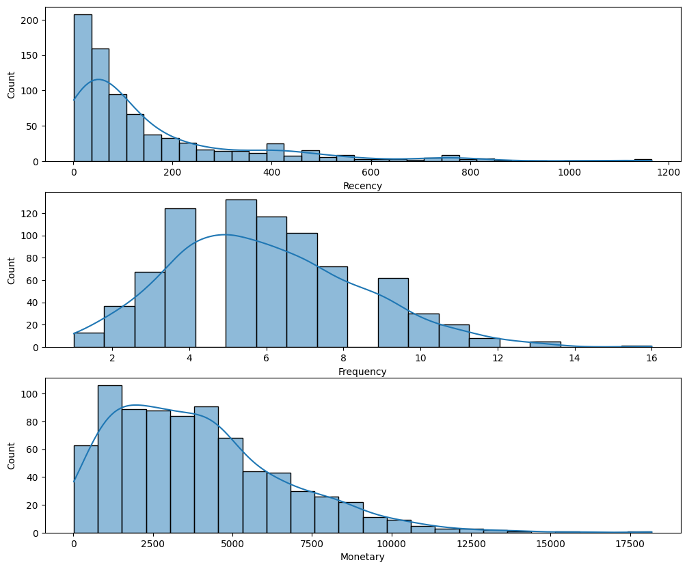
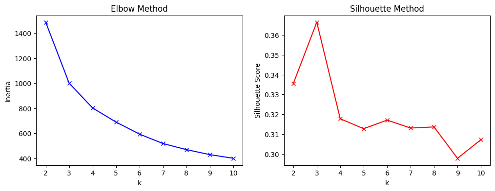

# Customer Segmentation Model

## Overview
This project demonstrates how to perform customer segmentation by combining RFM (Recency, Frequency, Monetary) analysis with clustering techniques such as K-Means. It helps businesses understand customer behavior and target marketing efforts more effectively.

---
## Features
Data preprocessing: Cleans and prepares transactional data.

RFM calculation: Computes Recency, Frequency, and Monetary features for each customer.

Data transformation: Applies scaling to normalize data.

Clustering: Uses K-Means to segment customers based on RFM scores.

Cluster evaluation: Employs metrics like Elbow Method and Silhouette Score to choose the optimal number of clusters.

Visualization: Provides insightful plots to interpret clusters and customer profiles.

Cluster profiling: Generates summaries of each cluster’s behavior for actionable insights.

---
## Dataset
The model is built and tested on the Superstore Dataset from the Kaggle.

The dataset contains detailed transactional data including invoice date, customer ID, and purchase amount.

Link to dataset: [Superstore Dataset](https://www.kaggle.com/datasets/vivek468/superstore-dataset-final?resource=download)

---
## Import libraries and load the dataset

---
## Preprocess the data

---
## Creating boxplots for 'Quantity' and 'Sales' to identify outliers

---
## Removing outliers

---
## Create boxplots after removing outliers

---
## Creating RFM

---
## Plot RFM distributions

---
## Standardize the data

---
## Fit KMeans clustering for a range of k values and calculate inertia and silhouette scores

---
## Fit KMeans with the optimal number of clusters (k=3 in this case)

---
## Assigning cluster names

---
## Creating a 3D scatter plot for RFM segmentation

---
## Summary

## 1. Platinum Customers 🏆

Behavior: Extremely loyal, frequent purchases, and the highest total spend.

Loyalty: Very high — short recency, high frequency, high monetary value.

Engagement Strategy:

Exclusive early access to new products.

VIP loyalty programs.

Personalized recommendations and premium support.

## 2. Gold Customers 🥇

Behavior: Regular buyers with good spending habits, but slightly less frequent or lower spend than Platinum.

Loyalty: High — moderate recency, good frequency, high monetary value.

Engagement Strategy:

Targeted upselling and cross-selling campaigns.

Seasonal discounts or bundle offers to encourage more frequent purchases.

Invitations to special promotions to encourage transition to Platinum tier.

## 3. Silver Customers 🥈

Behavior: Occasional buyers, moderate spend, may need reactivation campaigns.

Loyalty: Medium — longer recency, lower frequency, moderate monetary value.

Engagement Strategy:

Email reminders and personalized discount codes.

Incentives like free shipping to encourage more purchases.

Customer surveys to understand potential barriers to buying

---
## Reference

Unlocking Customer Segmentation Insights — Combining RFM Analysis with K-Means Clustering
[Customer Segmentation Insights](https://ishla.medium.com/unlocking-customer-segmentation-insights-combining-rfm-analysis-with-k-means-clustering-45bdc6bf8555)  

